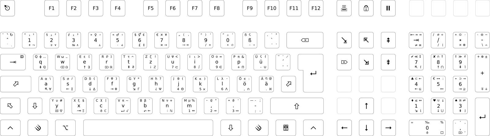

# NeoQwertz
NeoQwertz layout for printing keycaps. Hand-crafted and typographically optimized. Can be ordered by uploading the design to WASDkeyboards.

## Customizations

* The meta keys have the i3 logo. You may want to change that to your favourite window managers logo, a picture of a fat penguin or something else.
* On layer 5 on Shift + Mod3 + H, you get hbar (Plancks constant) instead of duplicate Psis as in the layout. Otherwise it matches the xkb layout file delivered with my Linux distro.

## Preview

